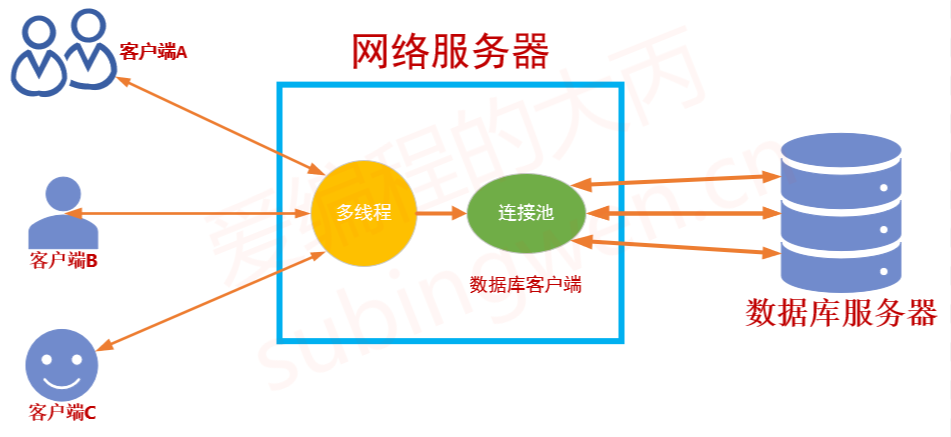

# 数据库连接池概述

我们在进行数据库操作的时候为了提高数据库（关系型数据库）的访问瓶颈，除了在服务器端增加缓存服务器（例如 redis）缓存常用的数据之外，还可以增加连接池，来提高数据库服务器的访问效率。

一般来说，对于数据库操作都是在访问数据库的时候创建连接，访问完毕断开连接。但是如果在高并发情况下，有些需要频繁处理的操作就会消耗很多的资源和时间，比如：

1. 建立通信连接的 TCP 三次握手
2. 数据库服务器的连接认证
3. 数据库服务器关闭连接时的资源回收
4. 断开通信连接的 TCP 四次挥手
5. 如果使用数据库连接池会减少这一部分的性能损耗。


接下来会基于 MySql 数据库（使用 MySQL 的 API 连接 MySQL 数据库）为大家讲解一下，如何使用 C++11 的相关新特性来实现一个数据库连接池。

整体为一个生产者-消费者模型

# 连接池的设计

要设计一个数据库连接池，我们需要实现以下几个功能点：

1. 连接池只需要一个实例，所以连接池类应该是一个单例模式的类

2. 所有的数据库连接应该维护到一个安全的队列中
   - 使用队列的目的是方便连接的添加和删除
   - 所谓的安全指的是线程安全，也就是说需要使用互斥锁来保护队列数据的读写。
3. 在需要的时候可以从连接池中得到一个或多个可用的数据库连接
   - 如果有可用连接，直接取出
   - 如果没有可用连接，阻塞等待一定时长然后再重试
4. 如果队列中没有多余的可用连接，需要动态的创建新连接
5. 如果队列中空闲的连接太多，需要动态的销毁一部分
6. 数据库操作完毕，需要将连接归还到连接池中




# 细节分析

1. 数据库连接的存储：可用使用 STL 中的队列 queue
2. 连接池连接的动态创建：这部分工作需要交给一个单独的线程来处理
3. 连接池连接的动态销毁：这部分工作需要交给一个单独的线程来处理
4. 数据库连接的添加和归还：这是一个典型的生产者和消费者模型
    - 消费者：需要访问数据库的线程，数据库连接被取出（消费）
    - 生产者：专门负责创建数据库连接的线程
    - 处理生产者和消费者模型需要使用条件变量阻塞线程
5. 连接池的默认连接数量：连接池中提供的可用连接的最小数量
    - 如果不够就动态创建
    - 如果太多就动态销毁
6. 连接池的最大连接数量：能够创建的最大有效数据库连接上限
7. 最大空闲时间：创建出的数据库连接在指定时间长度内一直未被使用，此时就需要销毁该连接。
8. 连接超时：消费者线程无法获取到可用连接是，阻塞等待的时间长度

综上所述，数据库连接池的单例模式设计如下

```cpp
using namespace std;
/*
* 数据库连接池: 单例模式
* MySqlConn 是一个连接MySQL数据库的类
*/
class ConnectionPool
{
public:
    // 得到单例对象
    static ConnectionPool* getConnectPool();
    // 从连接池中取出一个连接
    shared_ptr<MySqlConn> getConnection();
    // 删除拷贝构造和拷贝赋值运算符重载函数
    ConnectionPool(const ConnectionPool& obj) = delete;
    ConnectionPool& operator=(const ConnectionPool& obj) = delete;

private:
    // 构造函数私有化
    ConnectionPool();
    bool parseJsonFile();
    void produceConnection();
    void recycleConnection();
    void addConnection();

    string m_ip;             // 数据库服务器ip地址
    string m_user;           // 数据库服务器用户名
    string m_dbName;         // 数据库服务器的数据库名
    string m_passwd;         // 数据库服务器密码
    unsigned short m_port;   // 数据库服务器绑定的端口
    int m_minSize;           // 连接池维护的最小连接数
    int m_maxSize;           // 连接池维护的最大连接数
    int m_maxIdleTime;       // 连接池中连接的最大空闲时长
    int m_timeout;           // 连接池获取连接的超时时长

    queue<MySqlConn*> m_connectionQ;
    mutex m_mutexQ;
    condition_variable m_cond;
};
```

